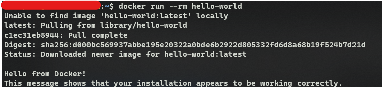
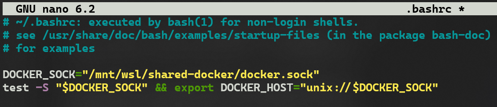

# Installing Docker with WSL2 Ubuntu

## Setting up WSL 2

Docker works on WSL 2, and _without_ requiring the robust but heavy Docker Desktop if that is undesirable.
To start - confirm the current WSL is version 2:
`wsl --list --verbose`  
Which should look something like:

NAME     STATE           VERSION  
Ubuntu    Running         2

You can also confirm with `wsl --set-default-version 2` which will also set the default as version 2 WSL.

### Configure admin (sudo) access for the non-root user

With Ubuntu, usually you set up the default user on first launch and sudo will be configured on behalf of the default user so usually you can skip this step.

**Notes:**

- When signed in as the user you set up (try `su myusername` if you are still root), can you `sudo -v` without an error?
- Don't leave the password empty as it will not be able to work and you will need to use root to reset the password.
- For more info on configuring sudo/default user please check out <https://dev.to/bowmanjd/install-docker-on-windows-wsl-without-docker-desktop-34m9> for more.

### Update/upgrade packages and test network connectivity

To run updates for the new WSL 2 Ubuntu Distribution:

- Debian/Ubuntu: `sudo apt update && sudo apt upgrade`

### Network troubleshooting

Upgrading the packages also serves as a networking test - which in essence if the above command worked you have network access. If however it has failed - most often it can be related to DNS settings which may need a little tweaking:  

```
echo -e "[network]\ngenerateResolvConf = false" | sudo tee -a /etc/wsl.conf
sudo unlink /etc/resolv.conf
echo nameserver 1.1.1.1 | sudo tee /etc/resolv.conf
```

The first line tells WSL to cease auto-configuring the `/etc/resolv.conf` file. Then we remove/unlink the old file, and create a new one. With this newly-configured DNS resolver (in this case, pointing directly to Cloudflare's DNS server) you can try upgrading packages again. Success? Excellent.

## Prepare for Docker Installation

### Removing old docker files

If you have experimented in the past with docker, then we first need to clear out the residual docker installs:

- Debian/Ubuntu: `sudo apt remove docker docker-engine docker.io containerd runc`
Then, install pre-requisites for Docker:
- Debian/Ubuntu: `sudo apt install --no-install-recommends apt-transport-https ca-certificates curl gnupg2`

### Debian/Ubuntu: switch to legacy iptables

Docker [utilizes iptables to implement network isolation](https://docs.docker.com/network/iptables/). For good reason, [Debian uses the more modern nftables](https://wiki.debian.org/nftables), but this means that Docker cannot automatically tweak the Linux firewall. Given this, you probably want to configure Debian to use the legacy iptables by default:  

```
sudo update-alternatives --config iptables
```

And select iptables-legacy. (enter `1` in the below example:
  
If you are comfortable, instead, with nftables and want to configure nftables manually for Docker, then go for it. I suspect that most, however, will want to switch to iptables legacy.

### Debian/Ubuntu package repository configuration

On Debian or Ubuntu, first temporarily set some OS-specific variables:
`. /etc/os-release`

Then, make sure that `apt` will trust the repo:

```
curl -fsSL https://download.docker.com/linux/${ID}/gpg | sudo tee /etc/apt/trusted.gpg.d/docker.asc
```

`ID` will be either "ubuntu" or "debian", as appropriate, depending on what is in `/etc/os-release`.

Then add and update the repo information so that `apt` will use it in the future:  

```
echo "deb [arch=amd64] https://download.docker.com/linux/${ID} ${VERSION_CODENAME} stable" | sudo tee /etc/apt/sources.list.d/docker.list
sudo apt update
```

## Install Docker

Now we can install the official Docker Engine and client tools:
Debian/Ubuntu: `sudo apt install docker-ce docker-ce-cli containerd.io`

### Add user to `docker` group

The Docker daemon is a service that Docker requires to be running in the background. The service (`dockerd`) and client (`docker`) communicate over a socket and/or a network port. For communication over the socket, privileged access is required. Two ways to obtain this access:

- Run `docker` as root (i.e. `sudo docker`)
- Through group membership, grant specific users privileged access to the Docker socket
- In other words, unless you want to utilize `sudo` or root access every time, add your user to the Docker group, named `docker`: Fedora/Ubuntu/Debian: `sudo usermod -aG docker $USER`
 Then close that WSL window, and launch WSL again. You should see `docker` when you run the command `groups` to list group memberships.


## Sharing dockerd: choose a common ID for the `docker` group

If you only plan on using one WSL distro, this next step isn't strictly necessary. However, if you would like to have the option of sharing the Docker socket system-wide, across WSL distributions, then all will need to share a common group ID for the group `docker`. By default, they each may have a different ID, so a new one is in order.

First, let's pick one. It can be any group ID that is not in use. Choose a number [greater than 1000](https://en.wikipedia.org/wiki/Group_identifier#Reserved_ranges) and [less than 65534](https://en.wikipedia.org/wiki/Group_identifier#Type). To see what group IDs are already assigned that are 1000 or above:  

```
getent group | cut -d: -f3 | grep -E '^[0-9]{4}' | sort -g
```

Can't decide what number to use? May I suggest 36257. (Just dial DOCKR on your telephone keypad...) Not likely to be already in use, but check anyway:  

```
getent group | grep 36257 || echo "Yes, that ID is free"
```

If the above command returns a line from `/etc/group` (that does not include `docker`), then pick another number and try again. If it returns "Yes, that ID is free" then you are good to go, with the following:  

```
sudo groupmod -g 36257 docker
```

Once the group id has been changed, close the terminal window and re-launch your WSL distro.
_Note that the above steps involving the `docker` group will need to be run on any WSL distribution you currently have or install in the future, if you want to give it access to the shared Docker socket._

## prepare a shared directory

As with the last step, if you only plan on using one WSL distro, this next step isn't strictly necessary. However, if you would like to have the option of sharing the Docker socket system-wide, across WSL distributions, then a shared directory accessible to all is needed.

Let's first make a shared directory for the docker socket, and set permissions so that the docker group can write to it.

```
DOCKER_DIR=/mnt/wsl/shared-docker
mkdir -pm o=,ug=rwx "$DOCKER_DIR"
chgrp docker "$DOCKER_DIR"
```

## Configure `dockerd` to use the shared directory

Again, this step can be skipped if you opt against using a shared directory for the docker socket. However, you may have other settings you wish to put in `daemon.json`, so you may appreciate some familiarity with this topic.

I suggest using the configuration file `/etc/docker/daemon.json` to set dockerd launch parameters. If the `/etc/docker` directory does not exist yet, create it with `sudo mkdir /etc/docker/` so it can contain the config file. Then the following, when placed in `/etc/docker/daemon.json`, will set the docker host to the shared socket:  

```
{
  "hosts": ["unix:///mnt/wsl/shared-docker/docker.sock"]
}
```

## Launch `dockerd`

Most Linux distributions use systemd or other init system, but WSL has its own init system. Rather than twist things to use the existing init system, we just launch `dockerd` directly:  

```
sudo dockerd
```

There should be several lines of info, warnings related to `cgroup blkio`, and the like, with something like `API listen on /mnt/wsl/shared-docker/docker.sock` at the end. If so, you have success. eg:   
*Notes - if you come across a `connection timeout error while opening volume store metadata database`, you may need to stop systemctl docker  
Step 1: systemctl status docker (if docker is running) stop the docker.
step 2: systemctl stop docker.
step 3: dockerd
[](https://stackoverflow.com/posts/71136430/timeline)

Open another wsl terminal.  
If and only if you opted to use the shared docker socket in `/mnt/wsl/shared-docker` as detailed above, first set the `DOCKER_HOST` environment variable:  

```
export DOCKER_HOST="unix:///mnt/wsl/shared-docker/docker.sock"
```

Then, try out the docker cli:  

```
docker run --rm hello-world
```

You should see the "Hello from Docker!" message. eg: 

### Make sure `$DOCKER_HOST` is always set

if you opted for the shared docker socket directory and don't want to constantly set the Host variable, then the following may be desirable in your `.bashrc` or `.profile`:

```
DOCKER_SOCK="/mnt/wsl/shared-docker/docker.sock"
test -S "$DOCKER_SOCK" && export DOCKER_HOST="unix://$DOCKER_SOCK"
```

an example of it in the .bashrc: 
so now when you run a docker command the Host variable will be already set:
  
